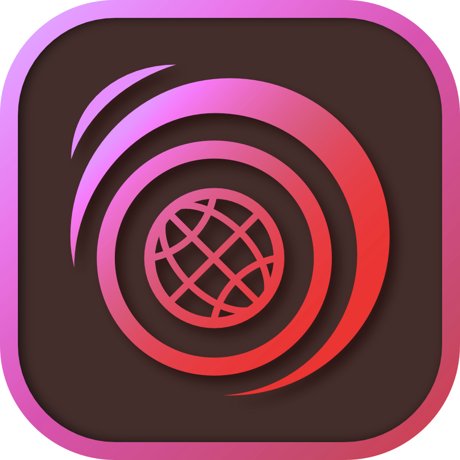

    <em>Your one-stop shop for everything anime on Web!</em>

# Kurozora      

[Kurozora](https://kurozora.app) is your one-stop shop for everything anime! The Kurozora website powers both the website and the API of Kurozora. It gives you access to the huge catalog of anime, manga and games. It is designed to be:

* **💨 Fast.** No clutter, no bloat, no complex dependencies. The Kurozora API is built with Laravel, one of the fastest PHP frameworks.

* **✨ Beautiful.** The codebase is carefully designed to be consistent and intuitive. By utilizing Laravel's features as much as possible, we prevent reinventing the wheel and writing spaghetti code.

* **🧪 Tested.** The team strives for a 99.9% test coverage. By combining PHPUnit and Laravel, we are able to write expressive, fast and insightful tests.

# Installation

Please refer to the **[Installation guide](INSTALLATION.md)** to learn how you can install `kurozora-web`.

# Contributing

Read our [Contributing Guide](CONTRIBUTING.md) to learn about reporting issues, contributing code, and more ways to contribute.

# Security

Read our [Security Policy](SECURITY.md) to learn about reporting security issues.

# Getting in Touch

If you have any questions or just want to say hi, join the Kurozora [Discord](https://discord.gg/f3QFzGqsah) and drop a message on the #development channel.

# Code of Conduct

This project has a [Code of Conduct](CODE_OF_CONDUCT.md). By interacting with this repository, or community you agree to abide by its terms.

# More by Kurozora

- [Kurozora Android App](https://github.com/kurozora/kurozora-android) — Android client app
- [Kurozora Discord Bot](https://github.com/kurozora/kurozora-discord-bot) — A versatile Discord bot with access to Kurozora services
- [Kurozora iOS App](https://github.com/kurozora/kurozora-app) — iOS/iPadOS/MacOS client app
- [KurozoraKit](https://github.com/kurozora/KurozoraKit) — Simple to use framework for interacting with the Kurozora API
- [Kurozora Linux App](https://github.com/kurozora/kurozora-linux) — Linux client app
- [Kurozora Web Extension](https://github.com/Kurozora/kurozora-extension) — Anime, Manga and Game search engine for FireFox and Chrome

# License

Kurozora Web is an Open Source project covered by the [GNU General Public License v3.0](LICENSE).
