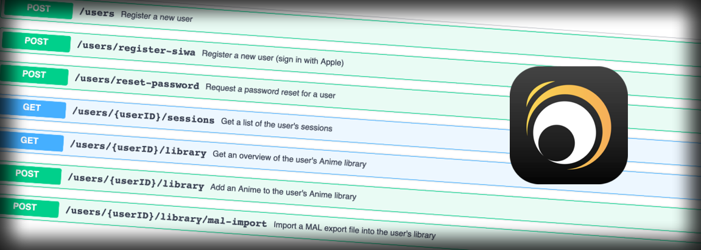

    <em>Track, share and discover anime with friends.</em>

## About Kurozora

**[Kurozora](https://kurozora.app/) is your go-to platform for tracking, sharing and discovering Anime and much more!.** `kurozora-web` is the server side behind Kurozora. It is designed to be:

* **💨 Fast.** No clutter, no bloat, no complex dependencies. The Kurozora API is built with Laravel, one of the [fastest](http://www.phpbenchmarks.com/en/benchmark/laravel/5.8) PHP frameworks.

* **✨ Beautiful.** The codebase is carefully designed to be consistent and intuitive. By utilizing Laravel's features as much as possible, we prevent reinventing the wheel and writing spaghetti code.

* **🧪 Tested.** The team strives for a 99.9% test coverage. By combining PHPUnit and Laravel, we are able to write expressive, fast and insightful tests.

## Installation

Please refer to the **[Installation guide](INSTALLATION.md)** to learn how you can install `kurozora-web`.

## Contributing

Please refer to the **[Contributing guide](CONTRIBUTING.md)** to learn how you can help.

This repository only holds the Kurozora server side application. iOS app development happens in [kiritokatklian/kurozora-app](https://github.com/kiritokatklian/kurozora-app).

## Security Vulnerabilities

If you discover a security vulnerability within `kurozora-web`, please send an e-mail to [mussesemou99@gmail.com](mailto:mussesemou99@gmail.com). All security vulnerabilities will be promptly addressed.
